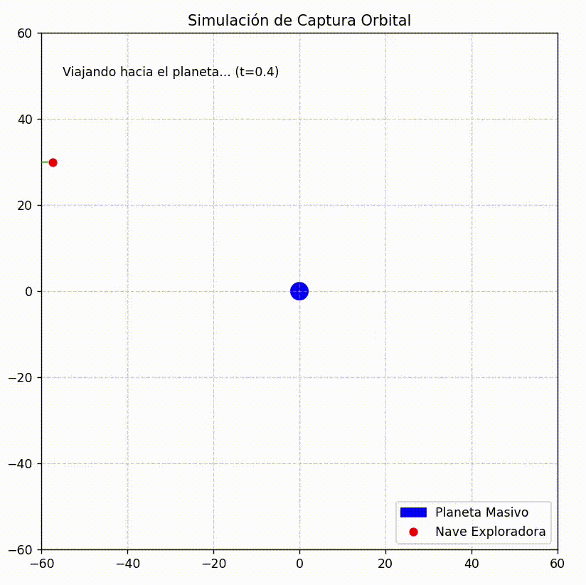
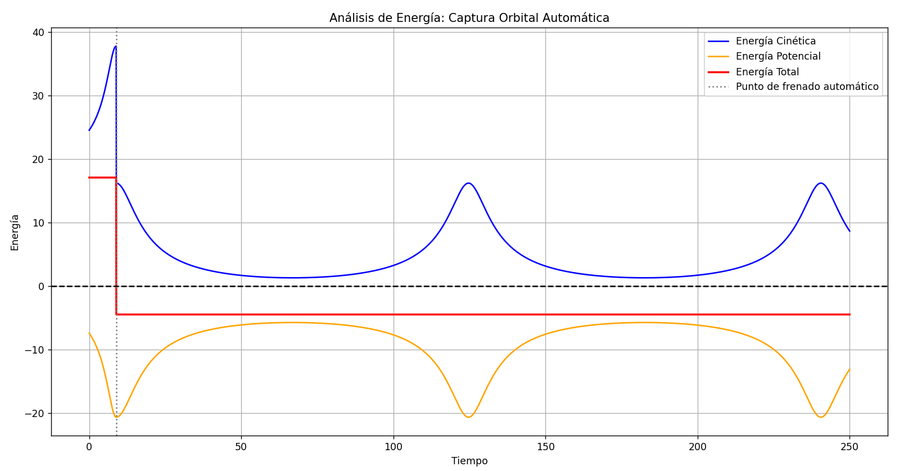

# simulacion-captura-orbital
Simulación computacional en Python de una captura orbital mediante frenado en el periastro. Utiliza POO, SciPy para ecuaciones diferenciales y Matplotlib para animación. Proyecto Final de Programación.
# Simulación Computacional de Captura Orbital 🚀🪐

**Proyecto Final de Programación**
* **Autor:** [Jhon Leandro Duque Pineda]
* **Ruta elegida:** Ruta 1 (Proyecto Computacional)
* **Lenguaje:** Python

---

## 1. Planteamiento del Problema y Objetivo (0.5)
En la mecánica orbital clásica, un cuerpo que viaja desde el espacio profundo a velocidad constante hacia un planeta masivo sigue una trayectoria hiperbólica, acelerando al acercarse y escapando de nuevo al espacio debido al principio de conservación de la energía (Energía Mecánica Total > 0). 

El objetivo de este proyecto es **modelar y simular la captura orbital de una nave espacial**. Para lograr que la nave pase de una trayectoria de escape a una órbita elíptica cerrada (Energía Mecánica Total < 0), el sistema simula el encendido de retrocohetes en el periastro (punto de máximo acercamiento), generando una pérdida de energía cinética calculada.

## 2. Diseño de la Solución y POO (1.2)
El programa fue diseñado utilizando Programación Orientada a Objetos (POO) para garantizar modularidad y escalabilidad, cumpliendo estrictamente con los lineamientos de la Ruta 1:

* **Clase Base Abstracta (`CuerpoEspacial`):** Define los atributos universales (nombre, masa, posición, velocidad) y exige la implementación del método `actualizar_estado`.
* **Herencia (`Planeta` y `Nave`):** Ambas clases heredan de `CuerpoEspacial`. La clase `Nave` incorpora métodos exclusivos como `encender_retrocohetes()` para modificar su vector de velocidad mediante álgebra de vectores.
* **Clase Gestora (`SimuladorOrbital`):** Administra el tiempo, calcula las energías y contiene el motor físico que resuelve las ecuaciones diferenciales.

## 3. Uso de Herramientas Científicas (1.0)
El cálculo de la trayectoria no utiliza aproximaciones simples, sino que integra las siguientes librerías:
* **NumPy:** Utilizado para el manejo eficiente de los vectores de estado $[x, y, v_x, v_y]$ y el cálculo de magnitudes vectoriales (normas) en las distancias y velocidades.
* **SciPy (`scipy.integrate.solve_ivp`):** Se utilizó para resolver el sistema de ecuaciones diferenciales de primer orden derivadas de la Ley de Gravitación Universal de Newton.
* **SciPy Events (Uso Avanzado):** Se implementó la propiedad `events` del integrador para detener matemáticamente la simulación en el momento exacto del periastro (cuando el producto punto entre el vector de posición y velocidad es cero), logrando un frenado de precisión sin "tiempos quemados" (hardcoding).

## 4. Visualización e Interpretación de Resultados (0.6)
El proyecto utiliza **Matplotlib** para generar dos visualizaciones clave:

### Animación de la Trayectoria
Se generó una simulación en 2D donde se evidencia el acercamiento, el frenado en el periastro y el establecimiento de una órbita altamente excéntrica.


### Análisis de Energía (Conservación)


**Interpretación de la gráfica:**
1. **Antes del frenado:** La Energía Mecánica Total (línea roja) se mantiene constante y por encima de cero, indicando una trayectoria de escape.
2. **El Frenado (Caída vertical):** En el punto de periastro, se evidencia la pérdida inducida de energía cinética, lo que hace que la Energía Total pase a ser negativa.
3. **Durante la órbita:** Se observan los picos inversos de Energía Cinética (azul) y Potencial (naranja). Al acercarse al planeta, la nave acelera (mayor $E_k$, menor $E_p$), y al alejarse en su órbita excéntrica, frena (menor $E_k$, mayor $E_p$). Físicamente, esto demuestra que la simulación es correcta, ya que la Energía Total se mantiene plana, respetando la Ley de Conservación de la Energía Mecánica.

## 5. Instrucciones de Ejecución
Para correr esta simulación en tu máquina local, asegúrate de tener instaladas las dependencias:

```bash
pip install numpy scipy matplotlib
